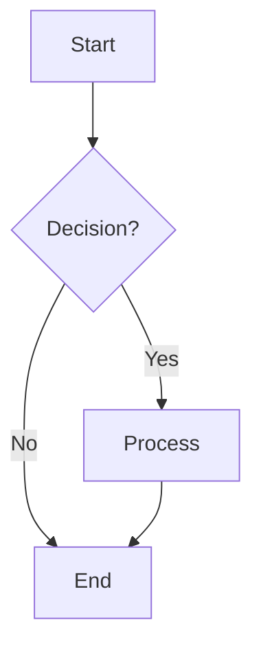
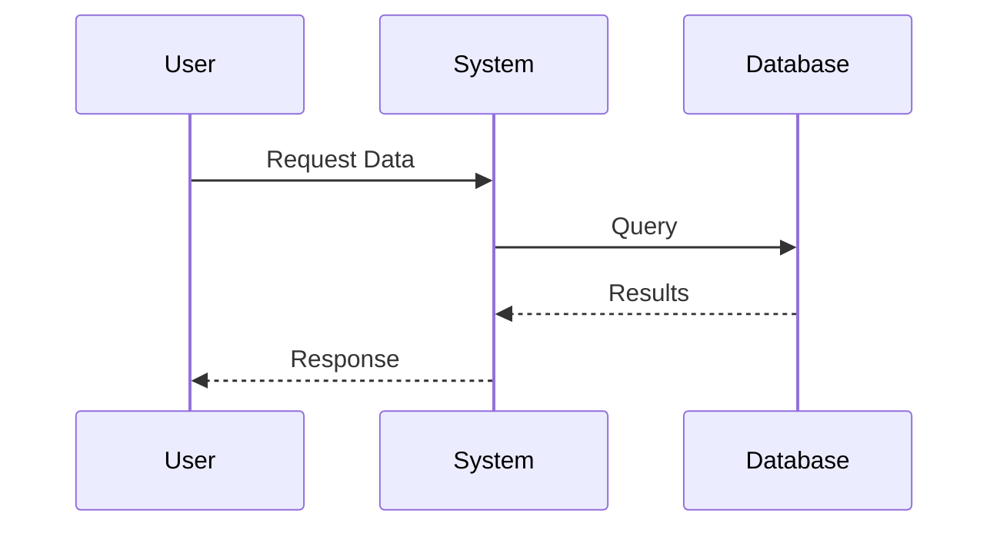

# Markdown Preview Test

This is a test file to verify that the markdown preview plugin is working correctly with images, KaTeX, and Mermaid.

## Images

### Online Image (should work)


### Local Image (will work if file exists in same directory)


## Mathematical Expressions with KaTeX

### Inline Math
The quadratic formula is $x = \frac{-b \pm \sqrt{b^2 - 4ac}}{2a}$ for the equation $ax^2 + bx + c = 0$.

### Display Math
The Euler's identity is one of the most beautiful equations in mathematics:

$$e^{i\pi} + 1 = 0$$

### Complex Mathematical Notation
For complex numbers, we have:
- $\RR$ for real numbers
- $\CC$ for complex numbers
- $\NN$ for natural numbers
- $\ZZ$ for integers
- $\QQ$ for rational numbers

## Mermaid Diagrams

### Flowchart


### Sequence Diagram


## Lists and Content

- Item 1
- Item 2
- Item 3

## Code Blocks

```python
print("Hello, World!")
```

## Conclusion

If you can see:
- ✅ The online image above
- ✅ Mathematical expressions rendered with KaTeX
- ✅ Mermaid diagrams rendered as flowcharts
- ✅ All other markdown content

Then the markdown preview is working correctly!
